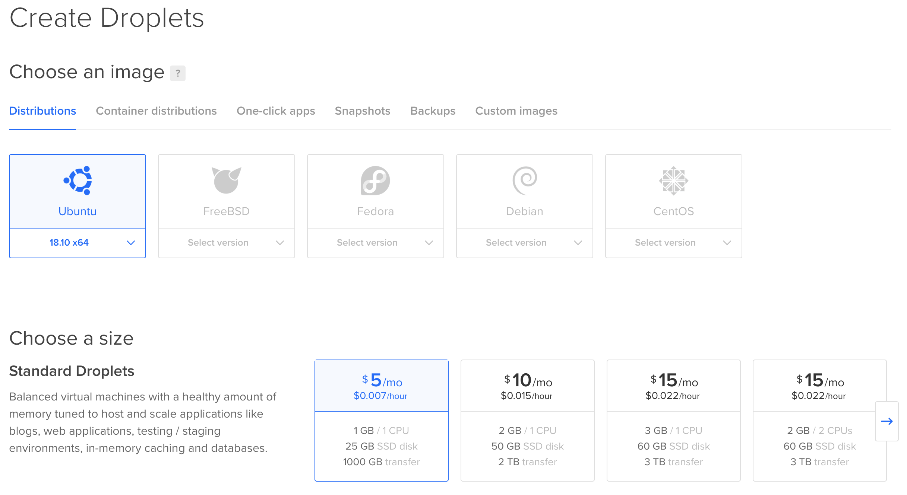

People often assume that any developers must know how to deploy an application to a remote server. The real case is that a lot of people aren't comfortable to push a website to production.

This article uses the Node.js framework [AdonisJs](https://adonisjs.com/) as an example, but the concept you'll learn is the same for any node-like languages or frameworks.

## Step 1: Create a Server

The first thing to do is to create a server. Let's assume that you don't have any VPS (Virtual Private Server) available and need to get one. I'm using the service [Digital Ocean](https://digitalocean.com/) to host my server, but any VPS could do it.

In the Digital Ocean "_Create a Droplet_" page, I'm choosing the latest version of Ubuntu and the smallest server I can have. **This server will be sufficient to run multiple Adonis application.**



You can leave the other settings by default, ensure to select a region that is near your target audience.

## Step 2: Secure Your Server

When your VPS is created and available use **SSH** to connect to it.

```bash
> ssh root@IP_OF_YOUR_DROPLET
```

Once connected, the first thing we will do is secure the server.

### Change The root Password

Type the command `passwd` and change the password to something long and complicated. You don't need to remember it when you will work on your server. Store it somewhere secure.

### Update Your Server

Even if you just created your server, it may be not up-to-date. Simple run the following command:

```bash
> apt update
> apt upgrade
```

### Enable Automatic Security Updates

Security updates are critical and can be automated. There's no need to connect to all of your servers every day to run a simple `apt update` & `apt upgrade` command to fix security holes.

```bash
> apt install unattended-upgrades
> vim /etc/apt/apt.conf.d/10periodic
```

Update the configuration file to look like the following:

```ruby
APT::Periodic::Update-Package-Lists "1";
APT::Periodic::Download-Upgradeable-Packages "1";
APT::Periodic::AutocleanInterval "7";
APT::Periodic::Unattended-Upgrade "1";
```

### Install fail2ban

[fail2ban](https://www.fail2ban.org/) is a service that scans logs of your server and bans IP that shows malicious behaviors (like too many password failures, port scanning, etc.).

```bash
> apt install fail2ban
```

The default configuration is fine for most people but if you want to modify it, feel free to follow [their documentation](https://www.fail2ban.org/wiki/index.php/MANUAL_0_8#Configuration).

### Create Your User

You should never work with the `root` user; it has full control without any restrictions that may put your system at risk. I'm using the username `romain`, feel free to change it.

```bash
> useradd -m -s /bin/bash -G sudo romain
> passwd romain
> mkdir /home/romain/.ssh
> chmod 700 /home/romain/.ssh
```

The commands above have created a new user with the username `romain`, created its home directory and added it to the `sudo` group. Now we can add our SSH key to be able to connect to the server with this user.

```bash
> vim /home/romain/.ssh/authorized_keys
> chmod 400 /home/romain/.ssh/authorized_keys
> chown romain:romain /home/romain -R
```

Before you continue, verify that you can connect to your server with this user.

```bash
> exit  # Quit the SSH session
> ssh romain@IP_OF_YOUR_DROPLET
```

Then run the following command to verify that you have access to root commands.

```bash
> sudo whoami # Should display root
```

### Lockdown SSH

By default, SSH allows anyone to connect via their password and to connect as root. It's a good practice to disable this and only use SSH keys.

```bash
> sudo vim /etc/ssh/sshd_config
```

Search and modify the following lines to change the configuration.

```text
PermitRootLogin no
PasswordAuthentication no
```

### Change the SSH Port

I like to change the default port of the SSH service. We have `fail2ban` to protect us against login brute-force, but it would be even better if we avoid them.

Nearly all bots that will try to brute-force the login system will reach SSH with its default port, which is `22`. If they don't detect that this port is opened, they will leave your server.

Still in the `/etc/ssh/sshd_config` file change the following line:

```text
Port XXXXX
```

Choose a port from 49152 through 65535. It's the dynamic and private range of available ports.

Then you can restart the SSH daemon, exit the current session and connect again with your user.

```bash
> sudo service ssh restart
> exit # If you aren't disconnected
> ssh romain@IP_OF_YOUR_DROPLET -p XXXXX
```

**UPDATE:** It seems that changing the default SSH port could be a bad idea for some reasons. You can read more about those in [this article](https://www.adayinthelifeof.nl/2012/03/12/why-putting-ssh-on-another-port-than-22-is-bad-idea).

### Install a Firewall

Ubuntu comes bundled with the great firewall `ufw`. Let's configure it.

```bash
> sudo ufw default allow outgoing
> sudo ufw default deny incoming
> sudo ufw allow XXXXX  # It's the port you used for your SSH configuration
> sudo ufw allow 80
> sudo ufw allow 443
```

**Be sure to have correctly allowed the SSH port. Otherwise, it will lock you out of your server!**

Finally, enable the firewall using the following command:

```bash
sudo ufw enable
```

## Step 3: Create a Deploy User

Now that your server is secured, and you have a personal account on it, we can create a deploy user that will be used by any administrators of your server to deploy and run your website.

```bash
> sudo useradd -m -s /bin/bash deploy
```

We don't need to set up an SSH key for this user since no one will connect directly to it. You will be able to access this user using the following command:

```bash
> sudo -i -u deploy
```

## Step 4: Install Required Dependencies

### Nginx

[Nginx](https://nginx.org/) will be our web server. We use it to proxied any incoming HTTP(S) requests to a local port.

```bash
> sudo apt install nginx
```

### Database Management System

An application often uses a DBMS to store data. We will use [MariaDB](https://mariadb.org/) in this article. Run the following command to install it and then follow the configuration wizard.

```bash
> sudo apt install mariadb-server
```

### NVM

**At this time, you need to be connected as your `deploy` user.**

[NVM](https://github.com/creationix/nvm) is a Node Version Manager. It will help us install and keep up-to-date the Node.js version we use.

```bash
> curl -o- https://raw.githubusercontent.com/creationix/nvm/v0.33.11/install.sh | bash
```

Then adds the following lines to your profile (`~/bash_profile`, `~/.zshrc`, `~/profile`, or `~/.bashrc`):

```bash
export NVM_DIR="${XDG_CONFIG_HOME/:-$HOME/.}nvm"
[ -s "$NVM_DIR/nvm.sh" ] && \. "$NVM_DIR/nvm.sh" # This loads nvm
```

After doing this, you need to restart your shell to have access to the `nvm` command. When it's done, you can install the latest version of Node.js using the following command:

```bash
> nvm install node
```

### PM2

[PM2](https://github.com/Unitech/pm2) is a Node Process Manager that will be used to keep our application alive forever.

```bash
> npm install pm2 -g
```

## Step 5: Deploy Your Application

It's time to clone your repository to get our application on the server! I highly recommend you to use a [deploy key](https://developer.github.com/v3/guides/managing-deploy-keys/#deploy-keys) to deploy your application. It will allow your server to pull the code but never push it.

Once you have set-up your SSH deploy key following the documentation of your git provider, clone the repository inside `/home/deploy/www`.

```bash
> cd ~  # This takes us the the home folder of the current user
> mkdir www
> cd www
> git clone https://github.com/adonisjs/adonis-fullstack-app.git example.com
> cd example.com
> npm i
```

Clone your `.env.example` file and change values according to your setup.

```bash
> cp .env.example .env
> vim .env
```

It's time to run your migrations and seeds.

```bash
> node ace migration:run --force
> node ace seed --force
```

Test that your application runs without any issue by using the following command:

```bash
> node server.js  # Followed by Ctrl+C to kill it
```

## Step 6: Configure Nginx

You can reach your application in your server local network, but it would be better to allow external visit! This is where [reverse proxy](https://docs.nginx.com/nginx/admin-guide/web-server/reverse-proxy/) enter on the dancefloor.

**This need to be done with your user, `romain` in my case.**

First, delete the default configuration and create a configuration file for your website. I like to name them with their URL, `example.com` here.

```bash
> sudo rm /etc/nginx/sites-available/default
> sudo rm /etc/nginx/sites-enabled/default
> sudo vim /etc/nginx/sites-available/example.com
```

The configuration will tell Nginx to listen for an incoming domain and forward all requests to a local port, your application.

```nginx
server {
  listen 80 default_server;
  listen [::]:80 default_server;

  server_name example.com;

  # Our Node.js application
  location / {
    proxy_pass http://localhost:3333;
    proxy_http_version 1.1;
    proxy_set_header Connection "upgrade";
    proxy_set_header Host $host;
    proxy_set_header Upgrade $http_upgrade;
    proxy_set_header X-Real-IP $remote_addr;
    proxy_set_header X-Forwarded-For $proxy_add_x_forwarded_for;
  }
}
```

The last thing to do is to enable this configuration and launch your application.

```bash
> sudo ln -s /etc/nginx/sites-available/example.com /etc/nginx/sites-enabled/example.com
> sudo service nginx restart
> sudo -i -u deploy
> pm2 start /home/deploy/www/example.com/server.js --name app
```

If you have set up your DNS correctly, you should have access to your application. Otherwise, since we used the `default_server` directive in our `listen` command, your application will be displayed by default when hitting the IP of your server.

## Step 7: Automate Via a Script the Deployment

Now that our application is running in production we want to create a script to automate future deployments.

```bash
> vim /home/deploy/www/deploy-example.sh
```

This script will simply do what we have done before:

1. Pull new changes from your repository;
2. Install new dependencies;
3. Run migrations;
4. Restart the application.

```bash
# Content of your script
cd example.com
git pull
npm i
node ace migration:run --force
pm2 restart app
```

Add the `x` flag to be able to run it.

```bash
> chmod +x /home/deploy/www/deploy-example.sh
```

Now when you want to publish a new release run the script `deploy-example.sh` with the `deploy` user.

## Step 8: Add SSL Certificate

The last thing to do is to add an SSL certificate to secure the connection between clients and our server. We will use [certbot](https://certbot.eff.org/) which will automatically enable HTTPS on your website deploying [Let's Encrypt](https://letsencrypt.org/) certificates.

```bash
> sudo add-apt-repository universe
> sudo add-apt-repository ppa:certbot/certbot
> sudo apt update
> sudo apt install python-certbot-nginx
```

Then, run `certbot` and follow the wizard to generate and set up your certificate.

```bash
> sudo certbot --nginx
```

--

Thanks to [Etienne Napoleone](https://twitter.com/etienne_na) for his proof-reading.
